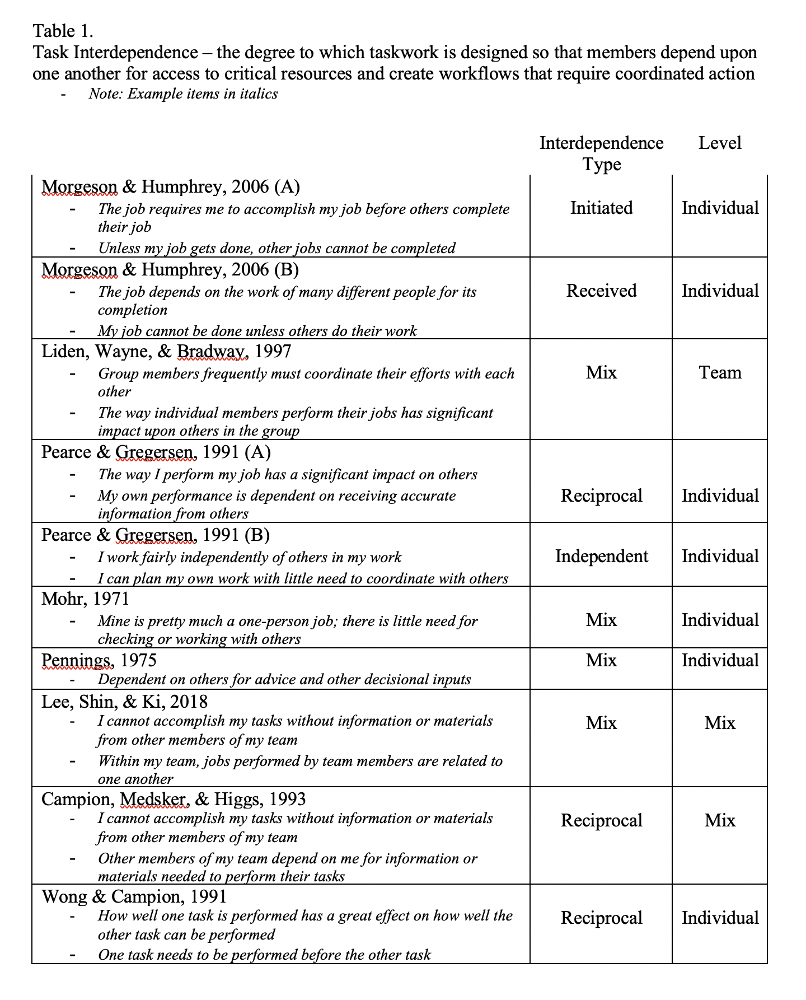
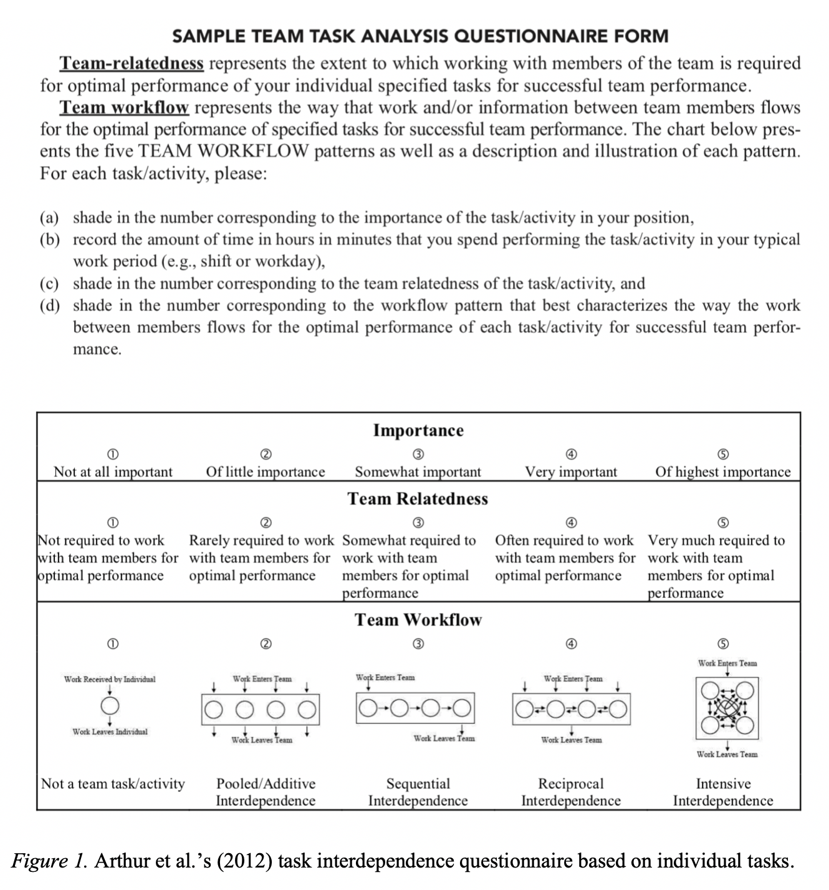
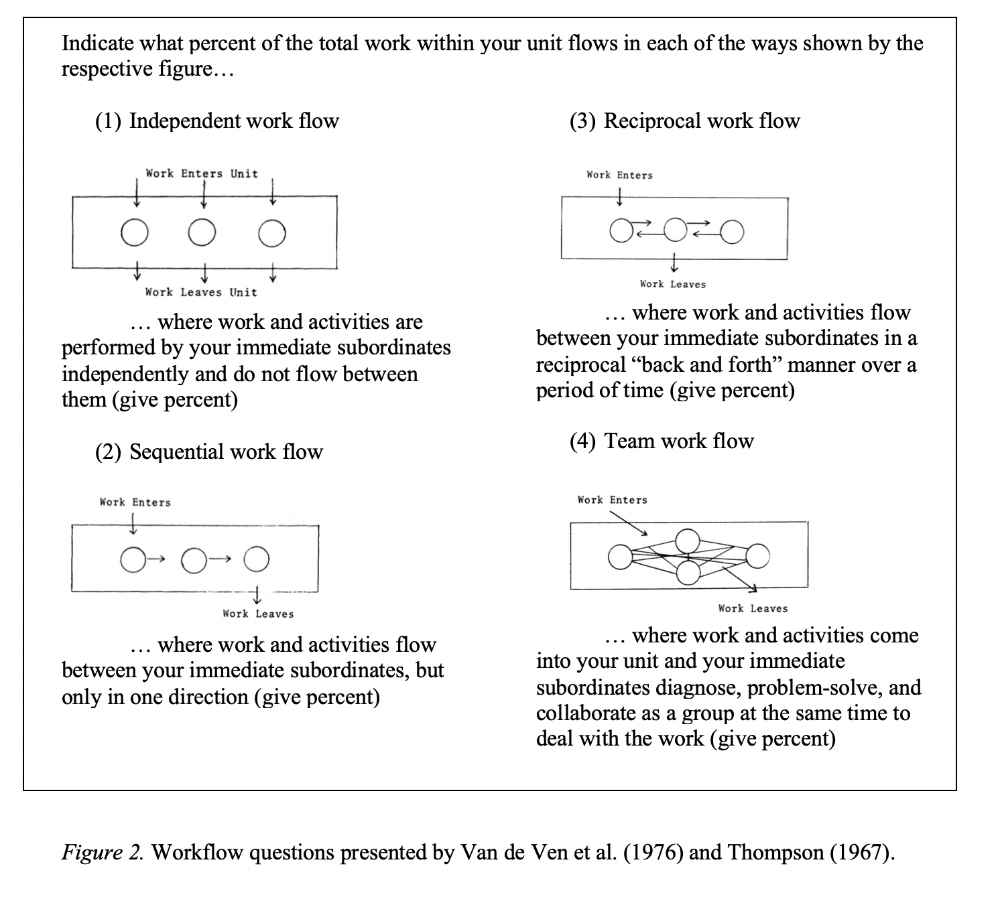
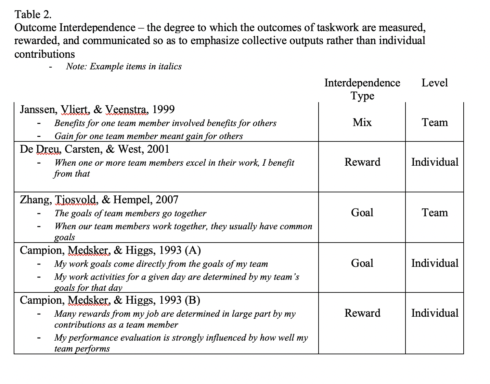

## Self Reports

Table 1 presents self-report measures of task interdependence. Items in this space assess perceptions about workflow patterns and the extent to which one or more tasks must be completed before others are initiated. Sample items include, "One task needs to be performed before the other task" [@wong_development_1991], and "Unless my job gets done, other jobs cannot be completed" [@morgeson_work_2006]. A handful of both individual and team level measures exist. Items at the individual level assess how one individual perceives his or her task in relation to others, e.g. "The way I perform my job has significant impact on others" [@pearce_task_nodate], whereas team level measures emphasize dependence without reference to any single individual, "Within my team, jobs performed by team members are related to one another" [@lee_why_2018]. As shown, most scales emphasize the individual level; a few contain both individual and team-referent items. 

Researchers using self reports have also distinguished between initiated, received [@kiggundu_task_1981], and later reciprocal interdependence [@pearce_task_nodate]. All are forms of task interdependence, but initiated occurs when "work flows from the focal employee to others" [@grant_7_2009], whereas received interdependence emphasizes how the focal employee is affected by work from others [@kiggundu_task_1981]. When both occur, the focal node is said to be under reciprocal interdependence. @morgeson_work_2006 provide a scale for both initiated and received interdependence, whereas @pearce_task_nodate provide items that measure reciprocal interdependence and *independence*. Other existing measures tend to emphasize reciprocal [e.g., @campion_relations_1993; @wong_development_1991] or mix items that reflect initiated, received, and reciprocal interdependence [e.g., @lee_why_2018; @pennings_interdependence_1975]. 

Individuals typically respond to task interdependence items with respect to all of their tasks, meaning that a focal individual is asked not about a defined activity such as giving a presentation but, instead, about her perceived interdependence in general. The exception is a study and measure provided by @arthur_team_2012. These researchers created a list of tasks that F-16 pilots completed during their training, gathered subject-matter-expert ratings of the interdependence among those tasks that could be used as an "objective" standard, and then created measures that were completed by individual pilots concerning their perceptions of interdependence *for each individual task*. The perceptions that emerged from the self reports then matched the SME-classified high, medium, and low task interdependent activities. The questionnaire provided by the authors is reprinted in Figure 1. For each task, individuals were asked to rate the extent to which they were required to work with other team members and then mark the pattern of workflow, such as pooled, sequential, or reciprocal. These authors also uniquely differentiate between team-relatedness, or the extent to which successful performance requires task interdependence, and team workflow, or the type of task interdependence as defined by Thompson (1967). The images of task relationships shown in their "team workflow" box are the same as those in @ven_determinants_1976 and Thompson (1967): the questionnaire used by @ven_determinants_1976 is shown in Figure 2. As shown, the images represent increasingly task interdependent work arrangements, moving from independent to sequential, reciprocal, and then team. Note that @bell_typology_2002 called the last task interdependence type "intensive" rather than "team." In @arthur_team_2012, members are asked to rate each task with respect to the task interdependence work flow type, whereas in Thompson (1967) and @ven_determinants_1976 individuals used the images to describe the nature of their work as a whole. 

Moving to outcome interdependence, Table 2 shows self reports currently in the literature. Items in this space assess perceptions about shared goals, e.g., "My work goals come directly from the goals of my team" [@campion_relations_1993] or benefits contingent on group rather than individual contributions, e.g., "Many rewards from my job are determined in large part by my contributions as a team member" [@campion_relations_1993]. There are a number of both individual [@de_dreu_cooperative_2007] and team-referent [@janssen_how_1999; @zhang2007transactive] measures. Campion et al. (1993) provide two separate scales, one for goal and the other for reward interdependence, whereas other researchers assess only goal interdependence [@zhang2007transactive], reward interdependence [@de_dreu_cooperative_2007], or use items that tap both domains [@janssen_how_1999].

### Challenges, Recommendations, and Next Steps

#### 1 Multi Level Composition and Compilation

Our tables reflect whether items assess individual or team perceptions of task/outcome interdependence, and readers will probably consider that notion with a section title labeled "multi-level," but the levels issue we draw attention to, instead, is among initiated, received, and reciprocal self reports. Many other discussions about appropriately moving from individual to team measures exist [@james_aggregation_1982], and those ideas should of course be considered as both individual and team-level interdependence items are in the literature (see tables 1 and 2), but the idea that reciprocal is on a different level than initiated or received has gone unnoticed. In our view, initiated and received task interdependence concern the perceptions of a single node. Reciprocal interdependence, though, requires multiple (at least two) nodes with shared perceptions about interdependence. 

To appreciate this idea fully, work up from an understanding of initiated and received at the individual level. Initiated has to do with work flowing out of a given node, and is assessed with items such as, "Unless my job gets done, other jobs cannot be completed." Received also concerns a single node, but it concerns work flowing into a given node, "My job cannot be done unless others do their work." These are perceptions at the individual level regarding a given task or job. When both are at play, researchers label the measure as reciprocal and use items such as, "The way I perform my job has a significant impact on others" and "My own performance is dependent on receiving accurate information from others." Our concern is not with the items or assessed construct, but with its label. To say that something is reciprocal is to imply words such as mutual, common, joint, corresponding, and complementary, meaning that more than one node has to agree with the pattern of in and out flows. This idea leads to an additional, untapped area for researchers to assess, which is the extent to which the perceptions of task outflows from one individual are shared by task inflow perceptions from another. If Jacob perceives outflow from his task in the direction of Roxanne, does Roxanne share that perception in the form of receiving inputs from Jacob? In our view, that is what reciprocal means -- an emphasis on two nodes and their shared perception of workflow that is consistent with Thompson's original 1967 writing and Van de Ven et al.'s 1976 instrument. 

What we are arguing for as next steps, then, is one of two directions. Either the current label given to reciprocal items such as those in Table 1 is replaced by a new term, such as "both," "full-flow," or "IR interdependence" (meaning that both initiated and received interdependence are perceived but *only for one individual*) and reciprocal is reframed to mean what we described above, or -- and probably the more reasonable approach given that reciprocal measures already exist -- future research considers how to extend reciprocal and perhaps introduce a new term that captures agreement between task in-and-out flows as originally implied by @ven_determinants_1976. Again, given that reciprocal already exists in the literature and a number of measures are at play, it makes sense to leave the label as is and adopt the second approach in future work. 

Irrespective of the route, future work can leverage existing discussions in @chan_functional_1998 and Kozlowski and Klein (2000) for how to proceed. An additive approach would simply sum or average the scores from two nodes regarding their task interdependence, whereas a direct consensus approach would entail an additional agreement score to justify aggregation. The more rigorous approach would be to provide both "I" and "We"-referent questions to both nodes, use an agreement index on the "I" scales to justify aggregation, and treat the "We"-phrased measure as the higher-level construct. Essentially, we are recasting the idea of initiated/received versus reciprocal into a levels idea from individual to dyadic.

#### 2 Task, Job, Person

The second tension is whether the focal node is a task, job, or person. Descriptions differ across reviews and theories. For instance, @kiggundu_task_1981 describes initiated interdependence as the degree to which work flows from a particular *job* to one or more other jobs, whereas @grant_7_2009 state that it occurs when work flows from a particular *employee* to others. These differences carry over into measurement items, which sometimes refer to tasks, e.g., "How well one task is performed has a great effect on how well the other task can be performed" (Wong & Campion, 1991) and at other times reflect the person or job, "My job cannot be done unless others do their work" (Morgeson & Humphrey, 2006). 

In our view, there is a greater tension here than a simple wording difference. It is a theoretical and empirical question as to whether the mechanisms differ if the focal node of interdependence is a task, job, or person. If they do, it remains to be seen how much of an effect that has across the various measures. But the notion we want to point out is that measures should align with theory. If the theory and arguments being tested concern tasks, it may not be appropriate to use items that refer to jobs. @wong_development_1991 have argued that jobs are aggregations of tasks, which means that theorizing about one but measuring the other without justifying the translation in either direction would be untenable in the same sense as theorizing about individuals but measuring only team-level variables [@kozlowski_groups_2012].

#### 3 Purpose and Inference

Much like the application of a statistical model to data, we recommend that researchers think hard about the inference they wish to make and use that reasoning as a basis for which measure to choose. Our tables provide references and can be used as a guide for where to turn given a researcher's particular interest. When the focal nodes are tasks and researchers are interested in reciprocal task interdependence, Wong and Campion's (1991) scale can be used. If, instead, the focal nodes are people and their jobs in general and researchers are interested in received interdependence only, Morgeson and Humphrey's (2006) scale can be employed. The questionnaire designed by Arthur et al. (2012) is a good option when researchers have already conducted a task analysis and have enough information to inquire about individual tasks. Both goal and reward interdependence can be assessed at the individual level with items provided by Campion et al. (1993). 

By presenting these various resources and providing some traction on interdependence measurement, our literature will hopefully avoid unnecessary construct proliferation and/or contamination. As noted at the beginning of our paper, and made clear in Courtright et al. (2015), there are many different labels that sometimes refer to the same kind of dependence or researchers haphazardly switch between one label and another. At other times, different interdependence notions are chosen $\grave{a}$ la carte and then recombined to seemingly introduce an entirely new idea or construct. We recommend identifying the specific form of interdependence of interest first, finding appropriate measures, and being consistent throughout one's reasoning, writing, and measurement. 
