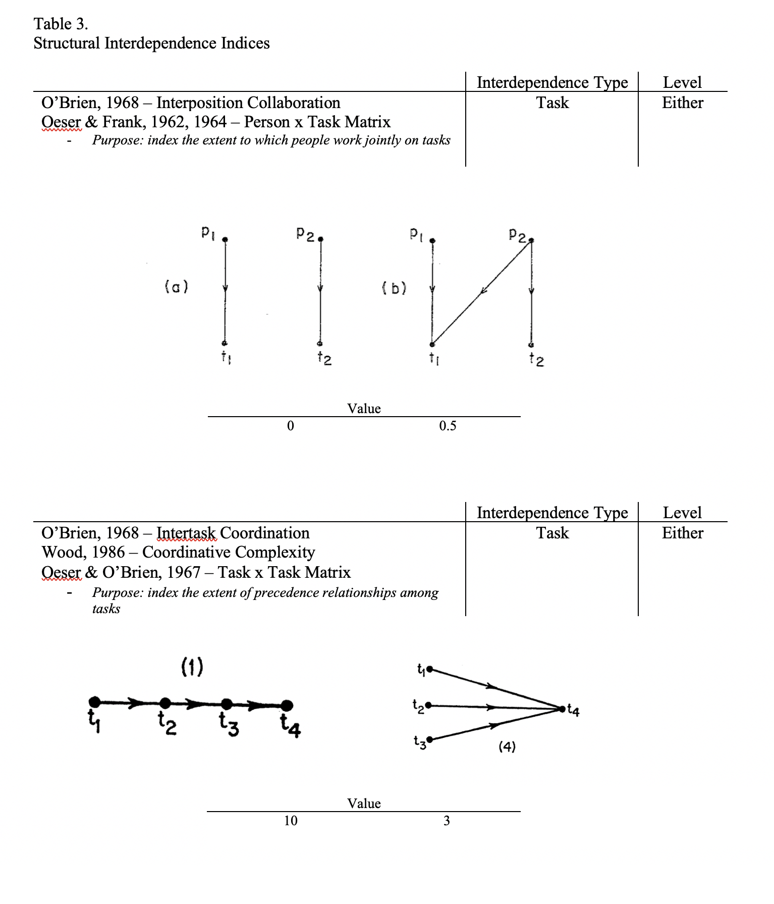
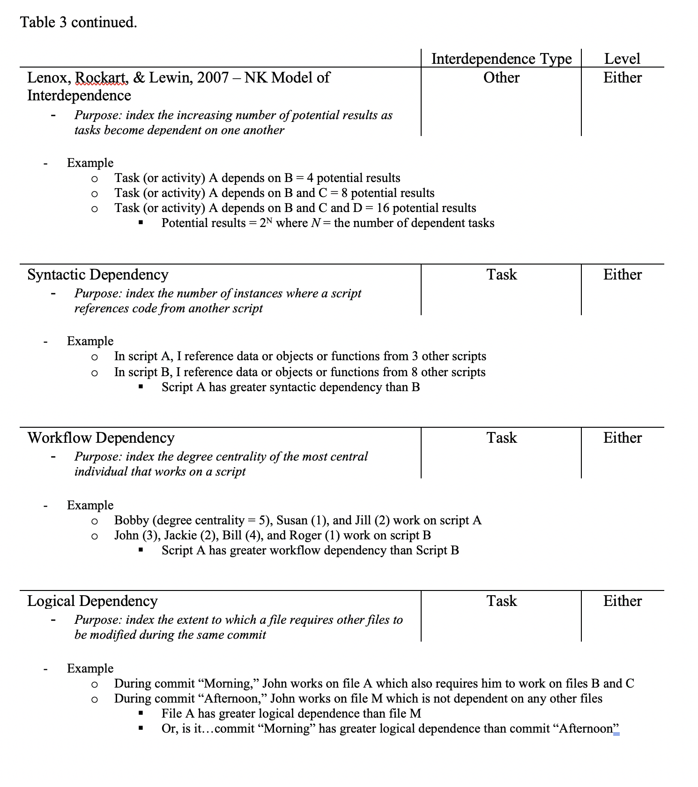
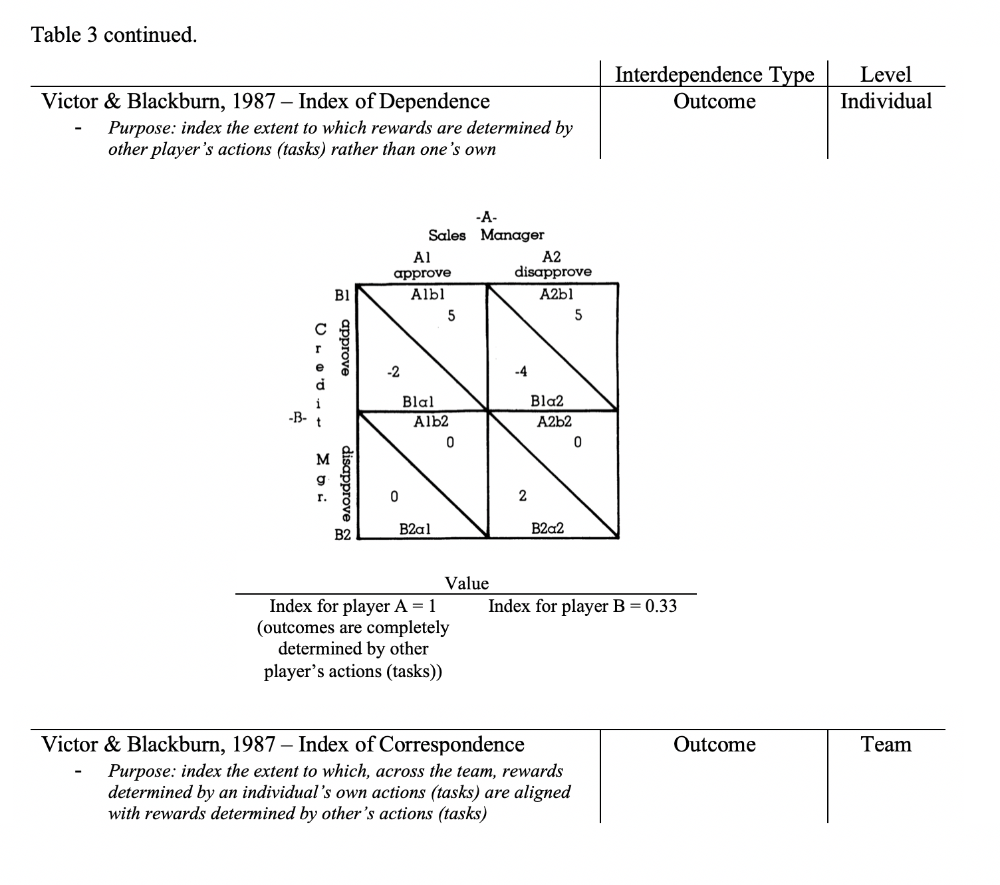

## Theoretical Indices

Researchers have also operationalized interdependence by presenting a number of formalas or methods for calculating an interdependence value outside of any perception by an individual emeshed within the task network. An index of task interdependence, for example, could come from a count of the number of task precedence relationships that exist in a unit, or, in other words, the number of tasks that require other tasks to be completed before they themselves can occur. The value of interdependence in these measures, therefore, comes from the researcher either presuming task relationships and structure in a theory or observing it in the field, although the latter is far less common.

Table 3 depicts interdependence indices. The first five come from the organizational science literature, whereas the last three are pulled from the computer science and software engineering literatures. Indices provided by @obrien_measurement_1968 and others cohere most directly with the notion of task interdependence represented in self reports, so we begin there. First, consider task precedence indices provided by @obrien_measurement_1968, @wood_task_1986, and @oeser1967mathematical -- row one of Table 3. These indices quantify the amount of precedence relationships in a task network. As shown in the images, when task one must be completed before task two, which must be completed before task three, which must be completed before task four, the index is greater than when tasks one, two, and three feed into task four but none of the first three tasks require precedent completions. In other words, a low value of the index means that tasks can be completed irrespective of the status of other tasks, performance on one does not depend on the performance or completion of another. @oeser1967mathematical originally introduced this index simply as the "task by task" matrix in their structural role theory, which was adopted and transformed slightly by @obrien_measurement_1968 and called the inter-task coordination index, and later used as part of a task complexity taxonomy by @wood_task_1986 and labeled coordinative complexity. The index associated with Oeser and O'Brien's (1967) task by task matrix can take on any positive, real value (zero included), whereas the inter-task coordination index provided by O'Brien (1968) is bounded by 0 and 1. Wood's (1986) coordinative complexity index is identical to O'Brien's (1968) inter-task coordination index. Note that the values we use in the example image include 10 and 3, so they come from Oeser and O'Brien's (1967) task by task matrix, but the other index would also classify the first task structure as more interdependent given the greater number of precedence relationships. 

Row two of Table 3 presents another common theoretical task interdependence index that is often ignored or confounded in self report ratings: the extent to which individuals work jointly on tasks. Now, the emphasis is not on precedence relationships or the extent to which tasks must be completed before others, but on the allocation of people to tasks and the extent to which people overlap in those assignments. To what extent is a given task completed by a single or multiple individuals? Oeser and Frank [-@oeser1964mathematical; -@oeser1962mathematical] originally introduced this index in their person by task matrix within structural role theory, and, as with the other index, O'Brien (1968) later adopted it and provided a scaling between 0 and 1 that he called inter-position collaboration. The images show two possible ways to assign two individuals to two tasks. In the first, each task is completed by a single individual so the index takes on a low value, whereas the index increases for the second arrangement where task one undergoes joint performance by both individuals. 

The next row of Table 3 describes the NK model of interdependence presented in the strategy literature by @lenox_interdependency_2007. This index captures the complexity of task or activity configurations within a unit. Imagine a unit or team with four tasks, A, B, C, and D, and assume that A depends on B and there are no other task dependencies. Take task A to be "training" and task B to be "find a manager to train the unit," where each can take on a binary value, 0 or 1, in which the options for A include error management or active learning whereas those for B include two different managers, Joe and Kelly. We can represent an arrangement in a task vector, such as [0, 1], which, in this case, means that the unit received error management training by Kelly, whereas the vector [1, 1] would mean that the unit received active learning training by Kelly. Given that A depends on B in this example, there are four task vectors that may produce unique values of performance for the unit: [0, 0], [0, 1], [1, 0], and [1, 1]. Said differently, the results of tasks A and B with respect to unit performance (or any other relevant outcome) could potentially differ in four ways due to the task arrangements that stem from interdependence. When task A depends not only on B but also on C, there are eight unique (binary) configurations, and when A then also depends on D there are 16 unique (binary) configurations. This index, therefore, represents the increasing number of potential results as tasks begin to depend on one another. 

The next three task interdependence indices in Table 3 come from software engineering and computer science: syntactic, workflow, and logical dependency. Before discussing them, it helps to briefly unpack common work activities for programmers. Imagine an individual who writes a script that will eventually become a website for a blog about cooking, music, and current events. The blog contains posts about the various topics, images displayed on each page, an interesting design in the background, links to similar material on other sites, and compiled reports on US trends garnered from scraping data from other places on the web. Often, code for different tasks will be stored within different scripts. One script may scrape and clean data from the web while another searches for and prepares links to other relevant material. A third script contains the text for each post, a fourth prepares images and charts. A master script then references each of these individual scripts and ultimately compiles the website, and, back down a level of abstraction, each individual script may reference yet other scripts that initiate basic functions and objects. All of the ways in which these various scripts "reference" one another, or pull code from different sources, creates dependence in a similar way that tasks more familiar to organizational psychologists do. The other aspect that merits attention before discussing dependence is commits. After writing code for one or several files, a programmer then commits her changes either to be checked by others or maintained indefinitely by the website. With these basic notions in mind, syntactic, workflow, and logical become easier to understand.

Syntactic dependency refers to the number of code references either across all scripts or within a single file. When Justin's code references two other files, A and B, his script is said to have less syntactic dependency than Rachel's code that references six other files. The units of comparison could also be entire sets of scripts rather than single files. Think back to the cooking, music, and current events blog mentioned above, perhaps its code, as an entire unit, contains greater syntactic dependency than the files, as a unit, from another site on sports commentators within the US. Whenever a script or set of scripts reaches elsewhere for additional code, syntactic dependency increases. 

Logical dependency is similar, but it incorporates commits. Essentially, this index captures the extent to which files, when worked on, require other scripts to be updated as well within the same commit. [More here after working out note within table]. 

Workflow dependency, finally, is the degree centrality of the person with the greatest degree centrality out of all of the people working on a script. Imagine two different scripts, A and B, each with an assortment of different people writing their code. Susie, Sarah, Savannah, Sam, and Sheryl write code within script A, whereas Robert, Rachel, Rome, Rupert, and Robin write code within script B. Out of all the people working on script B, Rome has the greatest degree centrality (4). Sarah, on the other hand, has the greatest degree centrality out of all of the people working on script A (10). Script A, then, is said to have greater workflow dependency than script B. 

Indices of outcome, rather than task, interdependence were presented in Victor and Blackburn's  [-@victor_interdependence_1987] writing on interdependence theory. They unpacked what is essentially a game theory framework for describing and quantifying actions and outcomes for two or more individuals. The matrix representation used in their paper is identical to normal form games in economics where players are situated either on the row or the column, along with their possible actions, and the values in the matrix represent the rewards, outcomes, or utilities for the row/column player. The example reprinted in Table 3, for instance, shows that the sales manager receives an outcome of 5 when she conducts action A2 while the credit manager conducts action B1. All of the examples described in their theory use actions and activities, but the ideas generalize to tasks as well. The index that we draw attention to is a number that Victor and Blackburn (1987) call the index of dependence that captures the extent to which the rewards/outcomes for one player are determined by the other player's tasks or actions (this number is not the specific value within an outcome matrix, such as 5 or -4 in the top right cell). For example, for a given move by the credit manager, the sales manager does not change her outcome by switching from action (task) A1 to action (task) A2. In other words, the outcomes associated with the network of tasks or actions are determined by the actions/tasks of the row player but not the column player. In this case, then, the index of dependence for the sales manager is 1, meaning that her outcomes are completely determined by the other player's actions (tasks). 

The index of dependence is computed for every individual in the game so that each person receives his or her own (potentially) unique value, but @victor_interdependence_1987 also provide a team-level index called the index of correspondence which captures the overlap between rewards governed by an individual's own actions (tasks) and those governed by other's actions (tasks). Imagine a system in which all players have some control over their outcomes given their task choices. Susan, for instance, can choose between writing (task 1) or scheduling meetings (task 2) and those tasks lead to different outcomes such that she has a preference for one over the other. Jackie also has task choices, she can choose to analyze data (task 1) or update the scripts for her shared website with Susan to improve its security (task 2). To the extent that Jackie's task choices influence Susan's outcomes irrespective of whether Susan chooses to write or schedule, Susan's index of dependence will increase -- her outcomes depend not only on her actions or tasks but also on Jackie's. The index of correspondence, conversely, is about the alignment of choices under one's own control with those not under one's own control. To what extent does the unit share preferences for actions, task completions, or task choices? One individual can collect different rewards for making different choices, but rewards are also determined by what the other player's choose. To what extent do those two tensions align?

### Recommendations, Challenges, and Next Steps

#### 1 Overlap Among Indices and Self Reports

Having discussed both the indices and self reports, we can discern their similarities and differences. The self reports tend to include the individual as the focal node and consider perceptions across all tasks, whereas the indices are more distinct: researchers created indices for task-task relationships, person-task assignments, and total task configurations. The exception among the self reports is @wong_development_1991: their survey refers to tasks as the focal nodes rather than using "I" or "Job"-referent items. For this reason, we expect their measure to be most similar in its nomological network to the inter-task coordination index presented by @obrien_measurement_1968. 

Another implication with respect to whether a person or task is the focal node is the extent to which the measure is robust to changes in the node identity. The inter-task coordination index, for example, distinguishes between work flowing from task to task and the people assigned to various tasks, whereas many of the self reports -- as well as the images in @ven_determinants_1976 -- refer simply to work flowing from person to person. There is no reason why some of the theoretical indices could not be modified to also capture the more general notion of person to person work exchanges, meaning that they should be robust, but perceptions about task interdependence captured within the self reports may differ dramatically when the referent is a single individual and his general job versus a single task and its requirements.

Another difference is that the indices capture a number of nuanced forms of task interdependence that may or may not be subsumed within the more general self report items. One of the most discussed aspects within the papers presented by @obrien_measurement_1968, @oeser1964mathematical, and @oeser1962mathematical is the notion of joint performance where two or more individuals work on the same task. This idea is not directly assessed in self reports, although it is possible that it finds its way into items such as "The way I perform my job has a significant impact on others."

Finally, there is no study that assesses alternative methods or discusses best practices for capturing fit between a theoretical index and perceptions of interdependence. Perceptions measured via a self report are compared to a standard in @arthur_team_2012 and @sherman_suboptimal_2011-1. Both studies use supervisors as SMEs and have them rate the interdependence of various tasks by showing them the images presented in Figure 2 -- those ratings are taken as an objective comparison in @arthur_team_2012 and @sherman_suboptimal_2011-1 refer to the SME ratings as latent interdependence. Although neither study compares self reports to the theoretical indices presented here, they can be taken as starting points for future work on fit methods. Research in this area would also benefit from a paper by @mccann_approach_1979 on interdependence perceptions. These authors identify several factors that they predict influence perceptions of interdependence, including, for instance, the number, amount, and frequency of resources exchanged per unit of time. Again, their discussion does not concern "true" interdependence between nodes but the variables thought to influence perceptions. They also identify a number of moderators such as the uncertainty in the environment and individual differences in the perceiver. Although it is a theory paper without data backing or denying its claims, future work could use @mccann_approach_1979 as a theoretical guide to determine variability in interdependence perceptions and how those do or do not overlap with interdependence captured in some of the indices presented here. 

#### 2 Index Dynamics

We discussed the indices, and many of them are presented, as single snapshots of a given arrangement among nodes. It would also be fruitful to consider the transition rules from moment to moment as indices develop through time. @wood_task_1986 notes that many aspects of interdependence deserve attention as to how they transition from one time point to the next, including the set of tasks required, their arrangement, and the relationships between tasks and the product. There are number of routes for research in this area. 

A straightforward direction would be to consider indice self-similarity through time by relating an index at $t$ to its value at $t-1$. There are many reasons why interdepence, both task and outcome, may either remain stable or change from one time point to the next, but even when it changes it must change from where it was at the previous moment and therefore will likely retain some level of self-similarity or autoregression. 

Another interesting application is to recognize that the tasks in O'Brien's [-@obrien_measurement_1968] inter-task coordination index could also be construed as time points. The author provides an index about relationships among nodes such as t1, t2, and t3, but there is no reason why those nodes must be separate tasks rather than one task repeating itself through time or subtasks completed at different time points within one global task. Seen in this view, the index would represent precedence relationships across time rather than across tasks. Other indices might also be created that quantify the stability or changes of interdependence relationships within a time window. Although we hesitate to call these broad-view ideas "dynamic" given that they emphasize general patterns across all time within the situation rather than moment to moment transitions [@deshon_multivariate_2012], they could still be very useful. 

#### 3 Purpose and Inference

A point that we want to continually make is that researcher choices regarding mesaurement and indices should follow the inference they wish to make and the purpose of their study. With the tables, figures, and explanations provided in this paper, we hope to more easily direct researchers to their measure of interest. If the interest is task interdependence with tasks as the focal node, syntactic dependency or the inter-task coordination index are viable options. If the interest falls more with respect to joint task duties, a researcher should opt for the collaboration index. Given the breadth of constructs and ideas subsumed within the broad idea of interdependence, it is important to be consistent across theory and measurement. 
